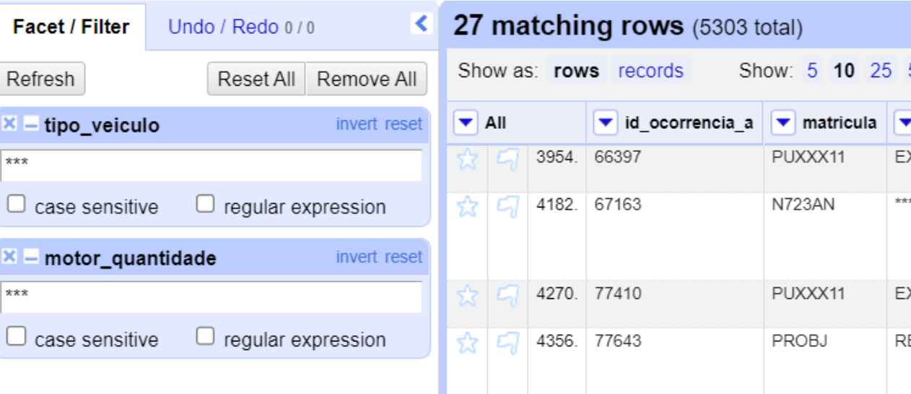

# Bootcamp: Data Science Analyst

## Module 2: Data and Information

- Practice - Open Refine

## Teaching Objectives

Practice the following concepts covered in the Module:

1. Download and install the [Open Refine](https://openrefine.org/download) tool.
2. Perform a data cleansing and transformation practice.
3. Export the manipulated file to a csv format file.

## Statement

Run an **Open Refine** practice to evaluate cleaning techniques and data transformation calls from *Data Wrangler*. *Data Wrangler* is the process of transforming and manipulating raw data to another format in order to improve the visibility of the information. With this process it is possible to build graphs, apply statistical functions, between others.

## Activities

OpenRefine is an open source desktop application for cleaning and data transformation to other formats, an activity commonly known as Data Wrangling. It is similar to spreadsheet applications and can handle spreadsheet file formats such as **CSV**, but behaves more like a database.

It operates on rows of data that have cells in columns, similar to way relational database tables operate. The projects OpenRefine consist of a table, whose rows can be filtered using facets that define criteria (for example, showing lines where a given column is not empty).

Unlike spreadsheets, most operations in OpenRefine are done
on **all visible rows**, for example transforming all cells
across all rows in a column or creating a new column based on
on existing data. The actions performed on a dataset are
stored in the project and can be 'repeated' in other sets of
data. Formulas are not stored in cells, but are used to
transform the data. The transformation is done only once. Expressions of formula can be written in General Refine Expression Language (GREL), in Jython (i.e. Python), and in Clojure.

The program works like a local web application: it starts a web server and opens the default browser to **127.0.0.1:3333**.

Once OpenRefine is running, you can open a browser of your choice and enter the address 127.0.0.1:3333 to access the graphical interface by your browser.


### Perform the steps below:

1. Download the [CSV File](./data/aircraft.csv) with the raw data that will be used in this practice;
2. Download the [Open Refine](https://openrefine.org/download);
3. After downloaded, run the file **openrefine.exe** (You must have the [Java JRE](https://adoptium.net/temurin/releases/) installed);


4. In OpenRefine, create the Project from the “aircraft.csv” file. **Select the file** and **click next**. The data will be loaded. Click the button on
top right “Create Project”.


5. Let's concatenate the manufacturer, model, engine_type,
engine_quantity.

- Click on **tipo_veiculo** > Edit column > Add column based on this column.
  


- Enter in the name of the new column: **“veiculo”**.
- Enter the following content in the Expression field: 
  
  ```
  value + " " + cells["**fabricante**"].value + " " + cells["**modelo**"].value + " " + cells["**motor_tipo**"].value + " " + cells["**motor_quantidade**"].value
  ```


6. Change the contents of the **operador_categoria** column to when the contents is “***”, become “undefined”.
   - Click operador_categoria > Edit cells > Replace


7. Now transform the entire content of the **operador_categoria** field to upper case.
   - Click **operador_categoria** > Edit Cells > Common transforms > To upper case


8. Sort the **id_ocorrencia_a** field in ascending order.
   


9.  Export the transformed data to a csv file.


## More Practices for recording results

Filter data

Each column contains a 'text filter' function. The text filter is useful for identify pieces of data that may have many variants.

1. Using the “Text Filter” option in the tipo_veiculo column, enter the value “\*\*\*” and note the number of records that are retrieved (it's in the header – **_xx_** matching rows).


2. Additionally, create a new filter together with the **tipo_veiculo** filter. Filter by **motor_quatidade**, inserting the value “***” as a filter.



3. Additionally, insert one more filter by **pais_fabricante** and inform “Brazil” as a filter. Note that brazil is in lower case.


4. If you check the “case sensitive” option in the **“pais_fabricante”** filter, what happens to the number of lines retrieved?


5. Clear all applied filters and let me know how many lines we have in our file.


6. What happens if you select the column **motor_quatidade** > view > Collapse all Other collumns?


7. You have Collapsed all Other collumns from column **motor_quatidade**. How do you make columns visible again?

- Clicking on each column
- Clicking in expand all

8. If you do a sort on the “**fabricante**” column using the text, casesensitive and descending sorting options, what is the first **fabricante** that will appear to you?


9. Now, I'd like to know how many aircraft the **fabricante** has = XAVANTE we have in our dataset.


